<div align="center">



<a href="https://spinlab.studio/">
  
</a>

<br/>

<a href="https://spinlab.studio/"></a>


</div>


## 🎰 &nbsp;Spinlab Studio

> **The platform operators use to launch and run their own online casino — in days, not months.**

I'm the **co-founder** of **[Spinlab Studio](https://spinlab.studio/)**: a multi-tenant, white-label iGaming platform. One engine powers many branded casinos, each with its own domain, look, games and payments.

<table>
<tr>
<td width="33%" valign="top">

**🃏 &nbsp;The product**

Player-facing casino sites, an operator backoffice and a platform admin console — casino and sweepstakes modes, sportsbook, game aggregators, crypto payments, bonuses, affiliates, KYC.

</td>
<td width="33%" valign="top">

**⚙️ &nbsp;The engine**

TypeScript end to end. AdonisJS APIs, Nuxt frontends driven by config, shared contracts in a pnpm + Turbo monorepo, Postgres at the core.

</td>
<td width="33%" valign="top">

**☁️ &nbsp;The infra**

Kubernetes on AWS, everything in Terraform, GitOps-style deploys, full observability and load tests gating every change to the hot path.

</td>
</tr>
</table>


## 🛠️ &nbsp;Stack

<div align="center">

**Backend** &nbsp;·&nbsp; **Frontend**


**Cloud & Ops**


</div>


## 🎲 &nbsp;House rules

```ts
const benjamin = {
  basedIn: 'France 🇫🇷',
  role: 'Co-founder @ Spinlab Studio',
  building: 'a white-label casino platform',
  roots: '6+ years of Java before going full TypeScript',
  obsessedWith: ['multi-tenancy', 'p99 latency', 'boring, reliable deploys'],
  motto: 'The house always wins — so build the house.',
}
```


## 📊 &nbsp;Stats

<div align="center">


<br/>


<br/><br/>


</div>


<div align="center">

**🎰 &nbsp;Place your bets. Ship to production. &nbsp;🎰**

</div>
